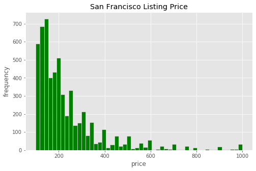
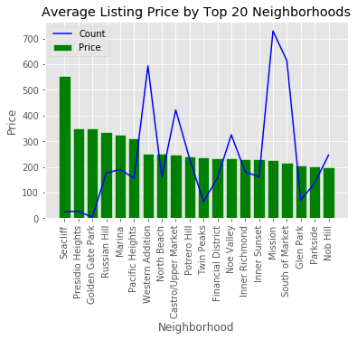
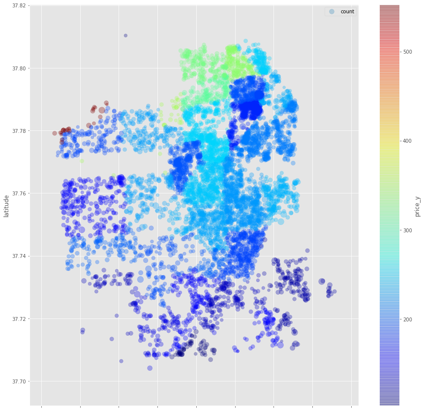
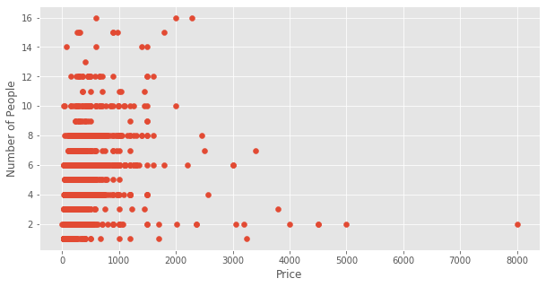
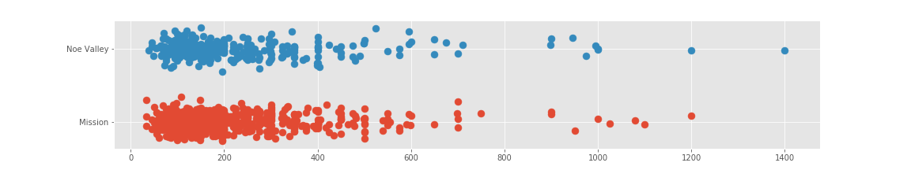
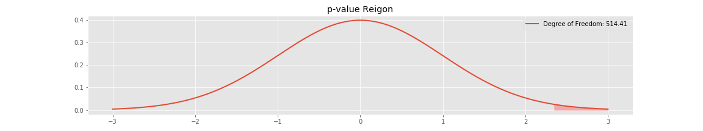
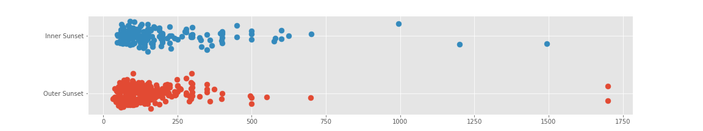
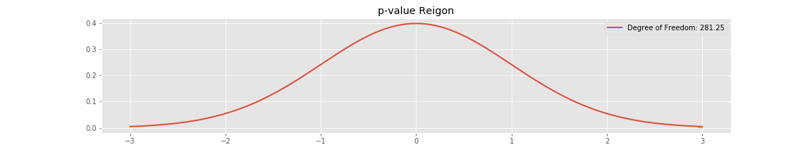

# Airbnb

## Table of Contents
- [Background](#Background)
- [Project Goal](#project-goal)
- [Data](#the-data)
- [Exploratory Data Analysis](#exploratory-data-analysis)
- [Analysis](#analysis)
- [Conclusion](#conclusion)

---

## Background 

Airbnb is an online marketplace for arranging and offering lodging and tourism experiences. Many individuals have been able to earn an extra stream of income through Airbnb by renting out lodging such as homes, apartments, private rooms lofts, and all kinds of other living space. Airbnb was founded in 2008 and had since made a huge impact in the tourism industry. According to [Airbnb Wikipedia](https://declara.com/content/A5YPWkg8), as of October 2018, it had over 1,000,000 listings in 34,000 cities and 190 countries. Airbnb has revolutionized the lodging market by providing opportunities for individuals to make extra income, keep hotel rates in check, and offer travelers more lodging options.

---

## Project Goal

Being raised in San Francisco, I am aware that house prices between neighborhoods can vary dramatically. Let's look at some pricing examples for neighborhoods that are in close proximity:

As of April 2020:
- Noe Valley median price: **$2,210,000**
- Mission District median price: **$1,530,000**
- Distance between the centers of the two neighboring districts is 1.8 miles.

The difference in median price between two neighborhoods in close proxmity is $680,000!

Now let's look at another group:
- Inner Sunset median home price: **$1,750,000** 
- Outer Sunset median home price: **$1,429,000**
- Distance between the heart of two neighboring districts is also 1.8 miles.

House prices play a role between districts, but how do Airbnb prices vary between them? In other words, if investors are looking to buy a property in San Francisco just for an extra stream of income through Airbnb, should they be saving close to one million dollars on purchasing properties in a less expensive neighborhood?

---

## The Data

Airbnb has public downloadable datasets between cities across the world. There are details of each listing, reviews and neighborhoods. I was mainly working off of the detailed listing dataset which contains all listings for San Francisco in 2019. Data was scraped June of 2019 and it has 7575 rows, 106 columns. 

---

## Exploratory Data Analysis

**How are listing price distributed across San Francisco?**

As expected, listing price generally concentrate on the lower end, with a handful of expensive listing with over $500 per night.

**How do price vary between neighborhoods?**

Graph below shows average listing price for the top 20 most expensive neighborhoods along with count of listings in the neighborhood. It does not seem to me that count of listings affect price. Now I am currious to see what affects pricing other than the location of listings.

I calculated the price per person rate for each listing by dividing listing price by number accommodated to get the average price per person. I plotted them using their latitudes and longitudes. Colors are by average price per neighborhood, circle sizes are by price per person for each listing. This image shows that listings in center of the city tend of have higher price, and then listings facing the Golden Gate Bridge (North) are the highest priced. 

**One would think that listing price would increase as number of guests allowed increase. Is that the case for listings in San Francisco?**

As it turns out not so much. This tells me that neighborhood might be the only factor that is affecting listing price.

---

# Analysis

## Mission vs. Noey Valley

- Mission 
    - Avg price: $225.95
    - Count: 730

- Noe Valley
    - Avg price: $234.12
    - Count: 325

Here is the distribution of listing price between the two neighborhoods.

One tail hypothesis test varialbes:
- Null Hypothesis: Noe Valley is more expensive than Mission by chance.
- Alternative Hypothesis: Noe Valley is truly more expensive than Mission. 
- Alpha Level: 0.05
- Welch Test Statistics: 2.34
- Degrees of Freedom: 514.41
- p-value: 0.0099

According to my findings, we can see that the Welch's test statistics is 2.34. The probability of having this result, or more extreme, given the null hypothesis is true is 0.0099. This is statistically signficiant enough for us to reject the null hypothesis. Airbnb listings in Noe Valley are generally more expensive than Mission.

### Mann-Whitney U-test
I also performend a Mann-Whitney U-test with  similar result with a p-value of 0.016. Noe Valley is clearly more expensive than Mission.

## Innser Sunset vs. Outer Sunset

- Inner Sunset 
    - Avg price: $230.24
    - Count: 161

- Outer Sunset
    - Avg price: $153.97
    - Count: 277

Here is the distribution of listing price between the two neighborhoods.

One tail hypothesis test varialbes:
- Null Hypothesis: Inner Sunset is more expensive than Outer Sunset by chance.
- Alternative Hypothesis: Inner Sunset is truly more expensive than Outer Sunset. 
- Alpha Level: 0.05
- Welch Test Statistics: 2.95
- Degrees of Freedom: 281.25
- p-value: 0.0017

According to my findings, we can see that the Welch's test statistics is 2.95. The probability of having this result, or more extreme, given the null hypothesis is true is 0.0017. This is statistically signficiant enough for us to reject the null hypothesis. Airbnb listings in Inner Sunset are generally more expensive than Outer Sunset.

### Mann-Whitney U-test
 The Mann-Whitney U-test with similar result with a p-value of 0.0000. Inner Sunset is clearly more expensive than Outer Sunset.

# Conclusion

In conlusion, both Welch's T Test and Mann-Whitney U Test return statistically significant result to indicate Airbnb listing prices do vary by neighborhoods in San Francisco,even if they are in close proximity. If an investor wants to purchase a property in San Francisco for listing in Airbnb, the location of the property is a good indicator of how much to charge for the listing. 

 

